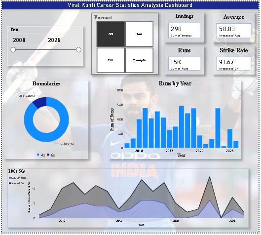

**Virat Kohli Career Statistics Analysis Dashboard 🏏**

This project is an interactive Microsoft Power BI dashboard that analyzes the career performance of Virat Kohli using batting statistics across multiple years and formats.

**Dashboard Overview**
The dashboard provides insights into:
Total Runs scored
Batting Average
Strike Rate
Total Innings played
Runs scored by Year
Performance across formats
Boundary analysis (4s & 6s)
100s and 50s comparison

**Key Insights**
Total Runs: 15K
Total Innings: 298
Batting Average: 58.83
Strike Rate: 91.67
Highest performance observed during peak career years

**Features**
Interactive Year Filter
Format-wise Analysis
KPI Cards
Bar Charts
Area Charts
Donut Chart Visualization
Performance Trend Analysis

**Tools Used**
Microsoft Power BI
Excel Dataset
Power Query
DAX Measures

**Data Cleaning Process**
The dataset was cleaned and transformed using Power Query by:
Removing null and blank values
Formatting year columns
Standardizing data values
Removing duplicate records
Applying Trim & Clean transformations

**Project Learnings**
Through this project, I learned:
Interactive dashboard creation
Data visualization techniques
Power BI data modeling
DAX calculations
Sports data analysis
Trend analysis and KPI reporting

**Author**
**Sehrish**
